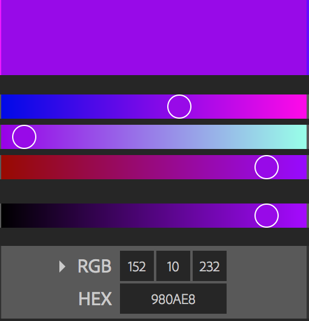

# P5 games in 60 minutes

## Intro and Setup

This quick intro is going to skip over a lot. The file structure and connections between the files have already been done for you. You'll want to click on the green "clone" button, and copy that URL. We'll use this URL to clone a copy of this project for you.

Then, in the console (whether you're on your own computer or in a Cloud9 integrated develoment environment) you'll type `git clone <the url>` with the URL filled in. It will likely look something like this:

```bash
git clone https://github.com/upperlinecode/intro-se-1-p5js-intro.git
```

Once this is done, you should see a directory called `intro-se-1-p5js-intro` and you should open it up. We're going to be doing all our coding in the play.js file.

Our js file isn't actually a webpage, though. So in order to see our work, we'll also want to open up the index.html file in a new tab. We won't code much of anything here, but you'll use THIS tab to run the preview and test your work. 

## 1. Draw Something!

Let's start by putting something on the page. In the play.js file. put the following code describing an ellipse inside the draw function:

```
function draw() {
  // p5 Will run these instructions continuously
  ellipse(100, 50, 80, 80);
}
```

Preview this code by clicking on the index.html file and clicking "live preview" up at the top.

This should draw an ellipse which has a center that is 100 pixels indented from the left, 50 pixels indented from the top, 80 pixels wide, and 80 pixels tall. Ellipses always take four arguments that follow this same patter: (x, y, width, height).

You'll notice that the color is black. if you want to change the color, you'll need to know the RGB (red, green, blue) color code of the color you'd like. One great place to play with colors you might want to use is the <a href="https://color.adobe.com/create/color-wheel/">Adobe Color Wheel</a>. Once you get a color you like, you'll see the hex code right underneath it. Look at this purple example I've found:



This color has three listed color values:
* Red => 152
* Green => 10
* Blue => 232
In other words, this color is made by mixing a LOT of blue light, some red light, and only a tiny bit of green light. We'll store this color in a variable called myPurple using this line of code `var myPurple = color(152, 10, 232);`.

If I want to color my ellipse like that, I'll need to add the color to my codeblock right before I draw the ellipse (just like you dip your paintbrush in a color right before painting the thing you want to paint). If we want to fill the inside of the ellipse/circle that color, we need to use the method `fill()`, and we'll put the color we want to use inside those parentheses.

```
function draw() {
  // p5 Will run these instructions continuously
  var myPurple = color(152, 10, 232);
  fill(myPurple);
  ellipse(100, 50, 80, 80);
}
```

#### Stretch Ideas:

All of these ideas can be implemented by referencing the <a href="https://p5js.org/reference/">p5 Documentation</a>.

* Try to figure out how to make the color of the outline of the shape match the inside.
* Try to draw a rectangle - can you put it behind the ellipse? In front of the ellipse? Can you make them two different colors?
* Try to draw a right triangle, an isosceles triangle, and an equilateral triangle.
* Try to draw the twister board:


## 2. Make It Interactive!

So you can put circles on the page, and that's cool, but let's make them follow your mouse.

Instead of having the ellipse go to the coordinate (100, 50), let's have it follow the x and y coordinates of the mouse. The p5 library actually has

```
function draw() {
  // p5 Will run these instructions continuously
  var myPurple = color(152, 10, 232);
  fill(myPurple);
  ellipse(mouseX, mouseY, 80, 80);
}
```

Now test it out by reloading your test page!

You'll notice that the draw function draws brand new ellipses continuously as you move your mouse. This will be true for anything you write in the draw function. It will keep doing those things over and over as long as the page is running.

#### BONUS: Stretch the Canvas

You also probably noticed that the screen seems to cut off on the right side - that invisible frame is the canvas. We can use built in variables to stretch that canvas more precisely, just like we did to have the ellipse follow the mouse. Change your canvas arguments from specific pixels to the more responseive variables `windowWidth` and `windowHeight`.

```
function setup() {
  // Set up the area where you'll be executing your code.
  createCanvas(windowWidth, windowHeight); // These built-in variables let you make the canvas exactly the same size as the user's browser window.
}
```

## 3. From Drawing to Movement!

Right now, the code adds new objects to the screen every time the draw function runs, which is great for creating art, but not so good for games. Let's create the illusion of motion by clearing the canvas every time.

Modify your draw function to include a `clear();` line like this:

```
function draw() {
  // p5 Will run these instructions continuously
  clear();
  var myPurple = color(152, 10, 232);
  fill(myPurple);
  ellipse(mouseX, mouseY, 80, 80);
}
```

Test it out! You'll notice that since it erases the previous circle every time it draws a new one, this draw function creates the illusion of animation.

## 4. Use Custom Variables!

We've used built-in variables to make the canvas match our user's browser, and to have our ellipse follow the user's mouse coordinates, but now let's see what it might look like to make something appear to move all on its own. We'll need custom variables and we will need to be able to modify them.

Since we're moving an ellipse, let's call our two variables `circleX` and `circleY`. Let's start them off equal to 50 and 50, which is pretty close to the top left corner.

Initialize these variables OUTSIDE the draw function - we don't want them to reset continuously. We only want to set them once.

```
var circleX = 50;
var circleY = 50;

function draw() {
  // p5 Will run these instructions continuously
  clear();
  var myPurple = color(152, 10, 232);
  fill(myPurple);
  ellipse(circleX, circleY, 80, 80); // Notice the change here
}
```

Notice the change on the ellipse, which now has it's center as (circleX, circleY), and since those variables are set to 50 each, that means this is the same as writing (50, 50).

Test the code, and you'll see your circle in the top left, just hanging out there.

But now we're going to do something special. Each time the draw function runs, we'll have it increase (or increment) those variables just a little bit. We will use this assignment operator, `+=`, which means "increase by...".

```
function draw() {
  // p5 Will run these instructions continuously
  clear();
  var myPurple = color(152, 10, 232);
  fill(myPurple);
  ellipse(circleX, circleY, 80, 80);
  circleX += 2;
  circleY += 2;
}
```

## 5. Build Something!

Try to figure out how to make your program more interesting by implementing a few of the following ideas:

* Make 5 different shapes of five different colors.
* Draw a shape with no outline (or stroke, as it's called in p5).
* Research how to make a random number in javascript, and see if you can use that to randomize the color of the shapes you make.
* Look in the p5 Documentation for the <a href="https://p5js.org/reference/#/p5/mouseIsPressed">mouseIsPressed<a> event. See if you can make the ellipse change colors when you click down.
* Look at the other <a href="https://p5js.org/reference/#group-Events">events</a> in the p5 Documentation. Try to implement one of the keyboard-based functions to make the ellipse move only when the arrows are pressed.
